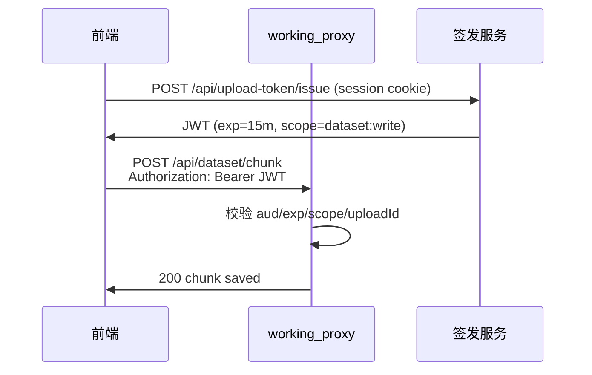

# 中期方案：短生命周期 JWT 上传令牌（设计文档）

> **状态**：仅文档，不改动现有 `X-Upload-Token` / `DATASET_UPLOAD_TOKEN` 静态令牌行为。

## 背景

当前网关使用长期静态 token（`.env` 中 `ANNOTATION_UPLOAD_TOKEN`、`DATASET_UPLOAD_TOKEN`）。适合小团队内网，但不便于：

- 按用户/任务授权与撤销
- 限制单次上传大小、扩展名、目标路径
- 审计「谁上传了什么」

## 目标

签发 **短生命周期（如 5–15 分钟）** 的 JWT，仅用于上传类接口；业务读写在 Supabase Auth 或现有 session 中完成。

## 建议 Claims

```json
{
  "sub": "user-uuid-or-id",
  "aud": "citysafe-upload",
  "scope": ["dataset:write", "shared:write", "annotation:write"],
  "uploadId": "up_abc123",
  "maxBytes": 1073741824,
  "allowedExt": [".zip", ".jpg"],
  "taskId": "optional-annotation-task",
  "exp": 1710000000,
  "jti": "unique-token-id"
}
```

## 流程（示意）



## 网关改造要点（未来）

1. 新增 `UPLOAD_JWT_SECRET`（或 JWKS URL），与静态 token **并存**：有 Bearer JWT 则优先 JWT；否则回退 `X-Upload-Token`。
2. `check_upload_token` / `check_dataset_token` 增加 `verify_upload_jwt(handler) -> claims | None`。
3. `init_dataset_upload` 将 `uploadId` 写入 JWT claim，防止跨 session 写 chunk。
4. 审计日志写入 `sub`、`jti`。
5. 可选：Redis/内存 blocklist 撤销 `jti`（登出、管理员封禁）。

## 签发端点（示意，未实现）

```
POST /api/upload-token/issue
Authorization: Bearer <supabase-access-token>
Body: { "scope": "dataset:write", "fileName": "data.zip", "size": 12345 }

Response: { "token": "<jwt>", "expiresIn": 900, "uploadId": "up_..." }
```

## 安全注意

- JWT secret 仅服务端；禁止进前端 bundle。
- `maxBytes` / `allowedExt` 在网关强制执行，不信任客户端单独声明。
- 预签名 MinIO 路径可改为 JWT 内嵌 `objectKey` 前缀，防止路径穿越。
- 保持现有静态 token 作为运维/脚本回退，文档化轮换流程。

## 迁移步骤

1. 部署 JWT 校验（默认关闭，`UPLOAD_JWT_ENABLED=0`）。
2. 前端新上传走 issue 接口；旧客户端继续静态 token。
3. 监控 `/api/health` 与审计日志；稳定后生产禁用静态 token 或限 IP。
